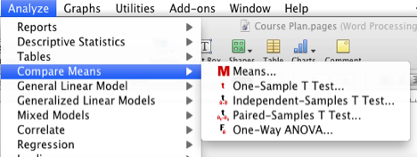
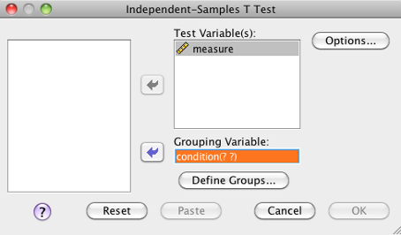
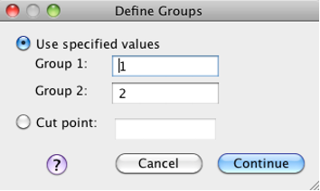
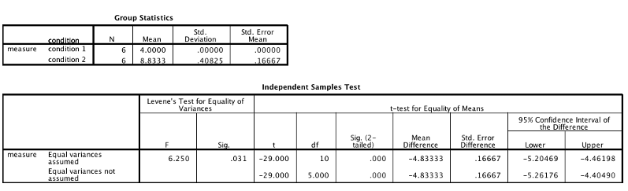
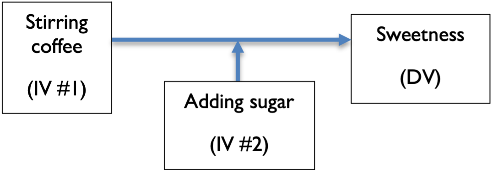
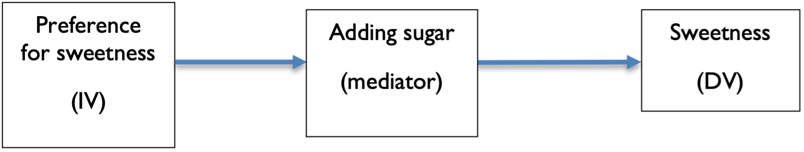

---
title: "Research Methods Course Pack"
author: "David Schuster"
date: "`r Sys.Date()`"
site: bookdown::bookdown_site
documentclass: book
output:
  bookdown::gitbook: default
  bookdown::pdf_book: default
bibliography: [book.bib, packages.bib]
biblio-style: apalike
link-citations: yes
github-repo: vectrlab/rm-course-pack
description: "This is the last revision of the legacy course pack used in my research methods course until 2020."
--- 

# About this Book {-}

This proto-textbook evolved from a collection of handouts used in my research methods course until 2020. I am making this available for former students who want to refer to these handouts but no longer have their original copies.

This book uses SPSS. I am preparing updated materials with more polished text and incorporating the use of R. 
As this book will not be updated further, I only recommend it to my former students who used it in their course.

# License

This work is licensed under the Creative Commons Attribution-NonCommercial-ShareAlike 4.0 International License. To view a copy of this license, visit http://creativecommons.org/licenses/by-nc-sa/4.0/ or send a letter to Creative Commons, PO Box 1866, Mountain View, CA 94042, USA.

```{r include=FALSE}
# automatically create a bib database for R packages
knitr::write_bib(c(
  .packages(), 'bookdown', 'knitr', 'rmarkdown'
), 'packages.bib')
```


# Introduction & The Scientific Method

## Science & Research

Science is the systematic generation of knowledge through observation. Research is the systematic collection and evaluation of evidence; it is the process by which science generates knowledge. These statements say a lot in just a few words; we will spend this section unpacking these statements.

## The Scientific Method

The scientific method describes an iterative process of using observation to make an educated prediction, testing that prediction, seeing if the test partially or fully supports the prediction, and generating a conclusion. This, in itself, is an observation, so it supports the next iteration of the cycle. Psychological science involves:
	
	1. Observe: Using informal observations , or the results from prior research, scientists wonder about the causes of thought or behavior. Scientists form a research question, which is a broad problem that can be addressed by research.
	2. Predict: Scientists form a hypothesis, a sentence that explains their observations. 
	3. Test: Scientists collect evidence to confirm or disconfirm their hypothesis.
	4. Interpret: The results of the test are integrated with the hypothesis and prior knowledge to understand whether the hypothesis is partially, fully, or not-at-all supported. When done well, this is when new knowledge is generated.
	5. Communicate: The new knowledge is disseminated, usually to other researchers working in the same area. We call the collection of written reports of research the scientific literature.
	6. No study will provide a complete answer to the research question. With the knowledge communicated by the study, the cycle starts again.
	
## Ways of Knowing 

Science is not the only way to answer questions about thought and behavior. The scientific method has a long history but a short one in Psychology, with experimental psychology only emerging in Germany in the mid-to-late 1800s (Pelham & Blanton, 2019). 

Intuition: If you answer based on what feels right, then you are using intuition. Intuition is arriving at a conclusion without much conscious thought.

Logic (rationalism): Logic is the use of reason. When we use logic, we apply what we already know as assumptions and then use them to draw conclusions, called inferences. An inference is logical if it follows from its premises. In other words, if the premises are true, is the conclusion also true? 

Authority: When someone else, especially someone in a position of power, answers the question for you, you are appealing to authority. 

Observation: Observation is the use of a direct source. You could observe something by using your own senses. You can also observe by using a device or another person to observe on your behalf. Reliance on observation is a central principle of the sciences. 

## Basic Principles of Science 

The acceptance of certain principles defines a scientist. The most important of these are empiricism, determinism, testability, and parsimony.

### Empiricism 

Empiricism is the belief that knowledge is gained through observation. Evidence is empirical when it comes from observation. This is distinguished from knowledge from tradition (authority) or someone’s ideas (intuition). Through empiricism, our ideas about the world can be challenged, modified, and updated in light of new evidence. Freud’s model of the Psyche had three components: id, ego, and superego. He developed this model by understanding theories suggested by others and developing his own. Without observable evidence, collected in a systematic fashion, such theories are ideas, not facts.

### Determinism

Determinism is the belief that all events have causes, and that those causes are systematic. Under this view, nothing is truly random. We may perceive what we see as randomness because we cannot observe or fully understand the complex network of casual factors that lead to an event. 

### Testability

A theory is testable when it can be confirmed or disconfirmed. Freud’s methods did not bother with testing: collecting observable evidence to confirm or disconfirm the components of the Psyche.
Falsifiability takes this a step further. A theory is falsifiable when it can be proven wrong. 

### Parsimony

Parsimony is a principle that the simplest solution is preferred. You can think of parsimony as a decision rule for a rather specific situation: When two explanations for a phenomenon are equally supported with empirical evidence, the simpler explanation is to be preferred. Among the other benefits, this principle offers protection from conspiracy theories. Conspiracy theories can be attractive because they provide better explanations because they add complexity. But, for any observable phenomenon, there are an infinite number of complex explanations. For example, why do planes have white lines (contrails) following them? Water vapor is a simple explanation (supported by evidence that they have existed since World War II), but conspiracy theorists have suggested that they are due to a government plot to poison us with metals and toxins (see https://www.bbc.com/news/blogs-trending-42195511 for the story). The existence of a secret spraying program requires massive government coordination, not just in execution, but also in covering it up. Is there evidence this is happening? No; according to a 2016 study, all but one of 77 atmospheric scientists surveyed said there was no evidence of toxin buildup. How might a conspiracy theorist respond?

We could take a neutral approach and weigh the evidence for each explanation. Parsimony doesn’t apply if there is stronger evidence for one explanation than another. But if there is no or equal evidence for both explanations, then parsimony says to go with the simpler explanation. Parsimony means that we are conservative in applying explanations to observed phenomenon. We need enough empirical evidence to outweigh a simpler explanation.

If you’ve ever repaired something, like a car or a computer, you may have applied this principle. As you start to diagnose a problem, before you do anything else, do you initially assume that several parts have failed simultaneously or that a single part is the culprit?

## Laws, Theories, and Hypotheses

Laws are broad statements about a phenomenon. Gravity is a law because it is something that has been demonstrated to exist and applies comprehensively across situations.
Laws are rare in psychology because little to nothing about humans can be stated absolutely. More commonly, we need to qualify our statements. Working fewer hours may lead to higher grades, but that relationship will not be true for someone dealing with homelessness. We use the term theory to describe our current explanation for a phenomenon. A theory is a general statement about the relationship between two constructs. A theory might state that homelessness is a major stressor that causes low academic performance.

When a theory is structured in such a way that it can be tested, we call it a hypothesis. Hypotheses are best stated as a relationship between two constructs. For example, homelessness is related to academic performance such that people who are homeless will have lower academic performance than people who are not. This is a hypothesis because we could gather evidence against or in favor of the hypothesis.

## Three Goals of Psychological Science

You may have noticed the term “construct.” There is an important distinction between constructs and measures. A construct is a “concept, model, or schematic idea” (Shadish, Cook, & Campbell, 2002, p. 506). Constructs are the big ideas that researchers are interested in measuring: depression, patient outcomes, prevalence of cumulative trauma disorders, or even sales. The problem is that we cannot access constructs directly, we have to make conclusions about them using measures. There is often disagreement and debate about how to define a construct. This is a big issue, and we will revisit the messy business of defining and using constructs later in the course.

Constructs are what we study. The goal of research psychology, then, is to identify and define constructs and then describe relationships between constructs. There are three goals here:

Describe the relationship between constructs. For example, what happens when you flip a light switch?

Explain why that relationship exists. Why does the light turn on when you flip the switch?
Describe the circumstances when the relationship holds. Does the switch always cause the light to turn on?

## Basic versus Applied Research

Basic research focuses on the generation of new knowledge. But we can also use knowledge to solve problems. If basic research tells us that people who are hungry have poorer recall (perhaps demonstrated in a task in a laboratory), then we might want to apply that knowledge in the form of an intervention, an action intended to change thought or behavior. We might give free breakfast in a school in the hopes that academic performance will improve. Recall that we do not really have laws in psychology because our findings almost never apply across all situations and environments. Because of that, there is usually a gap between the basic research and the intervention; we don’t know if the intervention will work on our specific problem. This is the major limitation of basic research; results often depend on the situation matching the phenomenon under investigation. A memory task is not necessarily the same as trying to do a high school class. Applied research focuses on the solution to a specific problem. An applied researcher might distribute free breakfast at one school and see if it outperforms a school without free breakfast. If you are thinking that the schools may differ in other ways than breakfast, you are using good critical thinking. This is the typical limitation of applied research; even if the breakfast school has higher performance, the findings might not apply outside of a school setting or even at a different level of school (i.e., elementary school). Basic research is better at uncovering truths that apply more broadly, but these increments are usually small.

But wait, there’s more! Some researchers identify squarely as basic researchers or applied researchers, depending on how important it is to them to solve specific problems with their research. But another way of thinking about basic and applied research was put forward by Stokes (1997) in his book Pasteur’s Quadrant. Research can try to develop our fundamental understanding, help us solve problems (which he called consideration of use), or do both.

-------------------------------------------------------------------------------------------------------------------------------------------
.                                           No consideration of use                Consideration of use
------------------------------------------- -------------------------------------- --------------------------------------------------------
Quest for Fundamental Understanding   	    Pure Basic Research (Niels Bohr)       Use-Inspired Basic Research (Louis Pasteur)
                                                      

No Quest for Fundamental Understanding                                             Applied Research (Thomas Edison)
                                                                                   
------------------------------------------- -------------------------------------- --------------------------------------------------------
Table adapted from Stokes (1997). Images are in the public domain.

## The Inductive Method and the Deductive Method

The method of induction means taking observations of specific cases and then generalizing outward, drawing conclusions about the phenomenon of interest. Imagine you interview an employee at a company and ask them what would make them more productive. Imagine that the employee said the office design really lowered their morale and productivity. If you then concluded that a new office design would improve productivity, you would be using the inductive method.
The method of deduction means starting with a conclusion and examining specific cases to see if the rule applies. If you want to see if a new office design improves productivity, then you test that, you are using the method of deduction to see if you rule (hypothesis) applies.
We use both methods in research. 

# Operational Definitions & Measurement

## Designing Research

We saw from the last section that conducting a research study involves forming a hypothesis, collecting evidence to confirm or disconfirm the hypothesis, and then interpreting the evidence.
Imagine you wanted to see if a placebo (a treatment with no effect) would cause people to experience less pain. This was the question of David J. Scott and his colleagues (2007 ). The study involved injecting participants (with their informed consent) with a saline solution that caused pain. Participants were given either fake pain reliever or no treatment. To support the claim that the placebo reduces pain, the placebo participants should report lower pain than the non-placebo participants. Pain was measured using self-report surveys. Let’s look at the building blocks of this study.

## Constructs versus Measures

The first concept is what the research is about. There is an important distinction between constructs and measures. A construct is a “concept, model, or schematic idea” (Shadish, Cook, & Campbell, 2002, p. 506). Constructs are the big ideas that researchers are interested in measuring: depression, patient outcomes, prevalence of cumulative trauma disorders, or even sales. For constructs in the social sciences, there is often disagreement and debate about how to define a construct. To do science, we must be able to quantify our observations (collect data) on the constructs. To go from a construct (the idea) to a measure requi res an operational definition. An operational definition describes how a construct is measured.

Constructs are what the study is about. The example study is about placebos and the reduction of pain. It isn’t really about saline solution or the Total Mood Disturbance measure as described in the article (Scott et al., 2007). The constructs of interest are placebos and pain. Pain was measured using the Total Mood Disturbance measure. Placebos were manipulated (the researcher controlled which participants were given a placebo and which were not).

## IVs and DVs: Variables in Your Study

Another term for the measure in a study is the dependent variable (DV). Researchers look for a change in the DV that is due to a manipulation (the administration of the placebo or none). We call the manipulation the independent variable (IV). A quick mnemonic (memory aid) for the IV is that it is the variable that “I control”. The IV is also sometimes called the treatment. Researchers look for IVs (the causes) that cause changes in DVs (the effects). Thus, if you are designing a strong study, you want your IV and DV to be strongly related to each other.

So far, we have seen that studies have constructs, at least an IV and a DV. Another term for DV is dependent measure or outcome. All studies need an operational definition that explains how the DV construct is represented as a measure.

But what about the IV? The researcher manipulated the IV; they did not measure it. The construct behind the IV in this example is the placebo. Studies also need an operational definition that explains how the IV construct is represented as a manipulation. Here, the placebo was manipulated by creating two groups; one received the placebo and the other one did not.

Do you see the pattern? Studies exist at two levels. The construct level describes the themes of the study. Constructs are how researchers tie studies together. If you were reading research reports on this topic, you would probably look for “placebo” and “pain.” You would not search for “sugar pill” and “Total Mood Disturbance Measure.” The second level is the measurement level (more generally, the operation level). The operation level is exactly what happened in the study. Constructs are what we investigate, operations are what we do.

Psychologists are operationalists because they use study operations to represent constructs of interest. Is it possible for two psychologists to disagree on the link between study operations and constructs? Yes, this happens all the time. What if participants did not believe they were taking a “real” pain pill? Or, what if the sugar pill actually had effects on pain? Psychologists do argue about whether study operations are a good match for study constructs (this concept is called construct validity, and we’ll revisit it later). But psychologists understand that there is no way to perfectly capture a construct using a measure. If we had to perfectly agree on all measures for all constructs, we would be essentialists. Psychologists also understand that we do not have access to constructs except through study operations. Thus, we don’t argue about the “true nature” of constructs (which would be essentialism). We define constructs based on the measures we use to capture them (which is operationalism). 

## Other Variables: Samples and Populations

What is the role of the cause of the pain in this study? You’ll notice it is neither a DV nor an IV. It is best described as part of the study’s setting. Researchers must also make decisions about the settings they represent in their study. Therefore, the setting of the study is another source of constructs. Finally, the participants in the study are also a construct. Who is the study about? This is the population of interest. Because most studies are about large populations, the study is conducted with a sample, a subset of the population. Again, researchers draw conclusions about the study constructs (the population) through observation of study operations (the sample).

Now that you can see the difference between constructs and operations, we will look closer at how we measure.

## Classifying Measurement Scales

We can classify measures in three ways: according to their level of measurement, whether or not they are continuous or discrete, and whether they represent qualitative or quantitative data.

### Level of Measurement

A stair diagram is used because higher levels of measurement satisfy all the requirements of the levels below.

			Ratio scale/ratio measurement.  Examples: weight, length
			Interval scale/interval measurement.  Example: Fahrenheit temperature
			Ordinal scale/ordinal measurement.  Example: the order in which people finish a race Nominal scale/Nominal measurement.  Example: gender
			
Notice that these levels are stair steps. Each level has all the characteristics of the level below it. So interval scales meet all the requirements of ordinal and nominal scales as well (plus they meet the additional requirement for interval scales).

To determine the level of measurement, ask yourself these questions:

1. Can you rank/order the numbers? (if no, nominal scale. if yes, keep going) example: kinds of fish. can you rank halibut and mullet? (no, nominal scale) example: Olympic medals, can you rank gold, silver, and bronze? (yes, keep going)
2. If you add/subtract the numbers, does the result have meaning? (if no, ordinal scale. if yes, keep going) example: 30 degrees F plus 10 degrees equals 40 degrees (yes, keep going) example: 1st place plus 2 equals 3rd place? (no, this doesn’t make sense, ordinal scale)
3. Does the score have a value of 0 that means ‘none’ or ‘nothing’? (if no, interval scale.  if yes, ratio scale) example: counting people; 0 people means no people (yes, ratio scale) example: 0 degrees F means no heat? (no, interval scale)

Continuous or Discrete

Separately, decide if your variable is continuous or discrete. If you can have an infinite number of fractions of a value, it’s continuous.  If you cannot, the measure is discrete. example: 5 yards, 5.0005 yards, 5.5 years, and 5.500001 yards are all valid measurements (continuous) example: Olympic medals; the measurement between gold and silver does not exist (discrete)

There may be instances where a grey area exists; at some level, all variables are discrete. For example, you could subdivide a measurement of length down to the molecule. At that point, you cannot have fractional values. Try to avoid over-thinking this issue. If you can reasonably talk about fractional values (half seconds; twenty-five cents are a fraction of a dollar) then the measure is continuous. If you cannot (there is no such thing as half a dog or an eighth of an employee), then the measure is discrete.

### Qualitative or Quantitative

**Quant**itative data is associated with a numerical value. **Qual**itative data is associated with labels that have no numerical value. Nominal and ordinal data are qualitative. Interval and ratio data are quantitative.

## Measurement in SPSS

See the handout “SPSS Basics” for how to represent measures in SPSS.

# Causality

## Experimental, Quasi-Experimental, and Non-Experimental Studies

Research psychology is a process of identifying constructs and describing how they relate to other constructs. We can classify research designs as experiments, quasi-experiments, and non-experiments. 

Experiments are the only kind of research that shows causal relationships (that is, that construct A causes a change in construct B). So an experiment could show if smoking causes lung cancer. To do this, experiments need two things (or they are not experiments) 

All experiments have a manipulation. This means that the experimenter changes something within the environment of the experiment (called an independent variable) to see if it causes a change in the outcome (called a dependent variable). For our smoking example, a manipulation would be assigning one group of participants to a lifetime of smoking and another group of participants to a lifetime of no smoking.

Experiments require random assignment. The experimenter decides when to vary the levels of the manipulation (change the manipulation) based on random assignment. Random assignment means that every participant has the same chance as being in one condition as another. For our smoking example, random assignment means each participant has a 50% chance of being in the smoking group.

As may be clear from the smoking example, we cannot always do experiments because of ethical (it would be wrong to assign people to smoke) or practical reasons (you cannot randomly assign people to genders, for example). The solution is a quasi- or non-experimental study.

In summary: experiments are powerful because they uniquely demonstrate causality (causal relationships). However, experiments require a manipulation and random assignment, which are not always possible.

In a quasi-experimental study, there is a manipulation but no random assignment. Whenever participants are assigned to levels of a manipulation non-randomly, the research is quasi-experimental. In a quasi-experimental smoking study, we could ask people if they had smoked before and assign them to smoking or non-smoking groups based on that answer. 

In summary: quasi-experiments do not require random assignment, but they do not show casual relationships.

In a non-experimental study, no manipulation is done. If you want to look at the effects of gender on lung cancer, you would simply observe (collect data on) the genders of patients. By only observing, you would not be manipulating gender. 

The differences between quasi- and non-experimental studies are sometimes slight (Pedhauzer & Schmelkin, 1991); if the researcher is manipulating an IV, then the work is quasi-experimental.

In summary: non-experimental studies are observational. Like quasi-experimental studies, they do not show causal relationships.

It’s worth repeating that only experiments demonstrate causality. Quasi- and non-experiments can show that a relationship exists but do not say whether one variable causes the other. Any non-causal relationship has three possible explanations:

1.	A $\rightarrow$ B	one variable causes another; in an experiment, this is the only explanation
2. B $\leftarrow$ A	the relationship is reversed; the first variable is actually the outcome
3.	C $\rightarrow$ A; C $\rightarrow$ B	a third variable exists that was not measured in the study; the third variable causes a change in both A and B. There are many ‘C’ variables, potentially.

In a non-experimental smoking study, you could not say whether smoking causes lung cancer or people who are predisposed to lung cancer are more likely to smoke. A third possibility is that a separate, third variable causes both lung cancer and a desire to smoke.  

## Demonstrating Causality

In the 19th century, John Stewart Mill said that we could be satisfied that a relationship is causal if the following three things could be demonstrated:

1. The cause preceded the effect
2. The cause was related to the effect 
3. We can find no plausible alternative explanation for the effect other than the cause

Experiments aim to identify causal relationships by manipulating something, observing the outcome, seeing a relationship, and using various methods to reduce other explanations.

## Statistics and Causality

Statistics are an important tool for establishing causality, but it’s important to know that the choice of statistical technique does not affect the level of causal evidence; demonstrating causality is the job of the research design, not the statistics.

A common misconception arises from the term correlational research design, which people use as a label for quasi-experimental and non-experimental research. It is easy to confuse this term with correlation which is a statistical technique.

Recall that statistics has two branches: Descriptive stats provides tools to summarize variability. Inferential stats provides tools for generalizing samples to populations.

To demonstrate causality, we need to satisfy Mill’s second requirement. Inferential statistics can help us do that. Two techniques are particularly useful: correlation (and its statistic r) and the t¬-test (and its statistic, t). Next, we will see how these techniques work.

## Correlation

In a correlation analysis, you measure two variables. Each variable needs to be continuous (fractional values allowed) or dichotomous (only two possible values). The correlation analysis will tell you if you have evidence that the variables are related. Related means that you could make a prediction of one value if you knew the other value. 

Correlation answers the research question:  How are two variables related (strength and direction)?  Actually, it only looks for linear relationships. There are four possible relationships between two variables:
Positively related variables: As one variable increases, the other variable also increases.  Higher scores of variable x are associated with higher scores of variable y.

Negatively related variables: As one variable increases, the other variable decreases.  Higher scores of variable x are associated with lower scores of variable y.

No relationship:  As one variable increases, the other variable might increase or might decrease.

Non-linear relationship:  As one variable increases, the other will change according to a function.

When you graph the two variables, they follow one of these patterns:  

- No Relationship
- Positive Linear Relationship
- Negative Linear Relationship
- Nonlinear relationship

## Two-Sample t-Tests

In a two-sample t-test, a researcher has two groups. Another way of saying this is that the t-test requires a discrete, dichotomous IV. Additionally, the t-test requires a continuous DV.

This analysis will provide evidence that two groups have different values of the DV. For example, if you are comparing an experimental drug with a sugar pill and measure patient outcomes on a 0-100 point scale (with 100 being a perfect outcome and 0 being the worst outcome), running a t-test can demonstrate that the sugar pill group and experimental drug patients had different scores.

## Choosing the Right Statistic

Both correlation and the t-test can show us if two variables are related. Thus, which one is the right statistic depends on the type of measurement used in the study, NOT whether the study is an experiment, quasi-experiment, or non-experiment. If you have two continuous variables, you should use a correlation. If you have a discrete IV and a continuous DV, you could use either correlation or a t-test. You can use a correlation to analyze experiments, quasi-experiments, or non-experiments. You can use a t-test to analyze experiments, quasi-experiments, or non-experiments. A correlation analysis is not the same thing as a “correlational research design.” For this reason, “experiment, quasi-experiment, and non-experiment” are much clearer labels.

## Ethics

It’s easy to develop research ideas in a vacuum. When your research questions involve thought or behavior, you may need to collect evidence from living people to answer your research question. Doing so requires consideration of research participants as human beings and not taking advantage of them. Although this may seem obvious, our discipline’s history is full of examples of researchers advancing science at the cost of health, wellbeing, and safety of research participants.

In 1979, the US Congress got involved, and the Belmont Report was released. The Belmont report describes the ethical framework for conducting research with human participants. From this origin, the following “big 3” of research ethics have evolved as fundamental principles for human-subjects research:

- Respect for persons: Treat participants as autonomous individuals. Participants are free to choose to participate in a study. Participants are not subject to coercion.  
- Informed consent is an important part of the principle of respect for persons. Tell participants what the study is about and ask their permission to participate. Allow them to withdraw their consent at any time.
- Beneficence: Do no harm. Balance risks to participants with benefits to participants. Note that benefits are not the same thing as compensation. Being cured of a disease is a benefit, being paid to participate in a study is compensation. Note, also, that a quest for knowledge in a study is a benefit to society and the researchers, it is not a benefit to the participants in the study. When considering risks and benefits, this principle applies to the individual participants.
- Justice: Justice means fairness. The people who bear the burden of research should receive its benefits, and vice-versa. 

Other ethical issues that can arise in research settings include:

-	Conflicts of interest
-	Fraud and accurate reporting of research results
-	Duplicate publication
-	Intellectual property and plagiarism
-	Use of nonhuman organisms in research

We will explore these issues in more detail later in our course.

# Validity and Reliability 

## Define validity and reliability

Reliability and validity are fundamental to critiquing psychological research and to developing your own high-quality research. There are different types of validity and reliability that are relevant to us, which sometimes confuses people. Because of this, introductory textbooks often present convoluted definitions of these concepts. Fortunately, the real definitions are simple:

Reliability means consistency. Something is reliable if it is consistent. The more consistency, the more reliability.

Validity means truth. Something is valid if it is true. Truth is either-or; there is no such thing as “more true” or “less true.”

In other words, good psychological science requires certain types of consistency and for some of the claims we make to be true. Next, we will look at the specific kinds of reliability and validity that are important for scientists.

## Types of consistency = Types of Reliability

Here are arguably the four most important types of reliability:

| Type of Reliability | Situation                                                                                                                                                                                    | Definition                                                                   | How to assess                                          |
|---------------------|----------------------------------------------------------------------------------------------------------------------------------------------------------------------------------------------|------------------------------------------------------------------------------|--------------------------------------------------------|
| Test-retest | You administer a measure to a participant, then wait some period of time, and give them the test again. The participant’s true score on the measure has not changed (e.g., IQ, personality). | The extent to which a measure is consistent across different administrations | Look for a correlation between the two administrations |
| Interrater | A measure involves two or more raters who record subjective observations (e.g., counting the number of times a participant has a tic, counting the number of times a married couple shows affection)	| The extent to which two observers are consistent in their ratings	| Look for a correlation between the two raters |
| Internal consistency | You are measuring a construct using several items (e.g., five items all rating your enjoyment of a course) | The extent to which items on a measure are consistent with each other; expected if the items measure the same construct	| Cronbach’s alpha (.7 is acceptable, .8 is good, and .9 is excellent) |

## Validity is a property of inferences

Validity is a specific kind of truth. Validity is the truth of an inference, or a claim. In other words, validity is a property of inferences. An inference (a claim) is valid if it is true.

For example, I could claim that the earth is round. Hopefully, it is a claim that you accept as being true. If you agree, then you could label my claim as valid.

Validity in research is frequently misunderstood, which leads to bizarre and confusing definitions of validity. There is no such thing as “a valid study.” Only claims about the study are valid or not. There is also no such thing as “a valid researcher.” A researcher can make claims. Only the researcher’s claims are valid or not. There is also no such thing as “more valid” or “increasing validity.” Validity is truth of a claim. Either a claim is true, or it is not.

For better or for worse, we usually don’t know with 100% certainty if a claim is true or false (if we did, we wouldn’t need the research). Therefore, research methods get very interesting when we listen to other researcher’s claims and then debate if we agree with them or not. When we do this, we are evaluating the validity of claims made about the study. Next, let’s look at different types of claims (inferences) that are made in research.

## Types of inferences in a study = Types of validity

Here are some of the most important types of validity. 

| Type of Validity	| Type of Claim	 | Definition | 	Example claim |
|-------------------|----------------|------------|-----------------|
| Construct validity	| The study operations represent the constructs of interest |	The truth of claims that study operations match study constructs	| “The Stanford-Binet was used to measure IQ” |
| Internal validity	| The study IV caused a change in the study DV	| The truth of claims that the IV causes changes in the DV | 	“The control group reported lower levels of stress than the experimental group, suggesting that the manipulation raised stress.” |
| External validity	| The study results apply to situation X | 	The truth of claims that the findings will apply as participants/units/variables/settings change.	| “Although data were collected from college students, a similar effect would be expected in working adults.” |
| Statistical conclusion validity | The statistical analysis was significant or not significant	| The truth of claims about the size and direction of the relationship between the IV and the DV. Or, that the statistical results are correct.	| “p < .05, indicating a significant difference” |
 
Finally, you might encounter these other types of validity, but they are less clearly defined and evaluated:

- Content validity: The truth of claims that a measure adequately samples (includes the important elements of) the domain of interest. For example, if IQ includes both verbal and math ability, an IQ test would need to have both verbal and math items.
- Face validity: The truth of claims that a study operation “seems like” the construct. For example, a study about distractions from mobile devices might not support claims of “seeming real” if the phone in the study is a paper mockup.
- Criterion validity: The truth of claims that a measure can predict or correlate with some outcome of interest. A personality test as part of a job application would have criterion validity if it predicted applicants’ success in the job.

## Threats to validity

Threats to validity are specific reasons why an inference about a study is wrong. They can help us anticipate problems in the design of our own research. The best way to address threats to validity is to change the design of our research. Understanding threats to validity also helps you critique research done by others.

There are many threats to validity. In this course, we will focus on the most common ones.

### Construct validity: When operations don’t match constructs

All threats to construct validity occur when the study operation does not match the construct of interest. Researchers usually clearly state the constructs that apply to their study in the introduction. They then make claims in the methods section that their study operations represent the constructs of interest. 

Threats to construct validity are explanations about why a particular study operation and its intended construct do not match. It could be that the measure is too general (using an IQ test to measure reading ability), or too specific (using a reading test to measure IQ). It could be the wrong construct (using an IQ test to measure happiness). It could be two or more constructs combined as one (a task performance construct measured with both speed and accuracy). This last example, where a study operation includes two or more constructs, is called construct confounding.

### Internal validity: GAGES

All threats to internal validity are confounding variables. A confounding variable is a “third variable” that can cause a simultaneous change in the IV and the DV. We looked at the effect of confounding variables when we talked about causality. Experiments provide strong protection from threats to internal validity because of random assignment. In quasi-experimental and non-experimental designs, internal threats to validity are much more likely.

The most common problematic third variables can be remembered as GAGES (Pelham & Blanton, 2019): Geography, age, gender, ethnicity, socioeconomic status.

### External validity: OOPS

Every threat to external validity is an interaction effect. An interaction effect means “it depends.” When a claim about how the study will apply to a new population or a new situation are false, it is false because the study has a different effect after the change.

The most common study variations that may affect study results can be remembered as OOPS! (Pelham & Blanton, 2019): Operations (changing the study operations), occasions (changing the time), populations (changing the people), and situations (changing the environment). 

### Statistical Conclusion Validity

All threats to statistical conclusion validity increase the odds of being wrong in your statistical conclusion. You may remember that these have names: Type I and Type II error. Put another way, a threat to statistical conclusion validity increases the chance of either a Type I or Type II error.

Low statistical power (sample size is too low, or the treatment is weak) can increase the chance of a Type II error; you might not be able to reject the null hypothesis when you otherwise should.

Fishing is running analyses over and over again until you find one that is significant, then ignoring all the non-significant results and just reporting the significant one. Fishing greatly increases the chance of a Type I error; if you do statistics this way, you’ll probably get significant findings that are spurious.

### Scientific Publishing

For both reading and producing science, knowing how publications work can be helpful.

Peer review means that the work was evaluated by professionals working in the same area. This is also called refereeing (i.e., a refereed article). Usually the reviewers are anonymous. 

Scientific publications range from more informal to more formal publications. More informal works allow researchers to get results out to the public faster, but they have less stringent review (or maybe no peer review). More formal publications take longer to get published, and they have the most thorough level of review, but they have the highest prestige since they have been scrutinized by the peer review process.

The most informal works are conference presentations. These can be presented in short talks or on a scientific poster. Poster sessions work like a science fair; researchers stand in front of their posters and answer questions from audience members about their work. Conference presentations usually do not have a paper attached to them. Authors might only write an abstract, and the reviewers accept or reject the presentation after only reading the abstract. On the SJSU campus, the Spartan Psychological Association Research Conference (SPARC) is a great first scientific conference. It is held toward the end of April each year.

Some conference presentations have a proceedings paper. The proceedings paper is a complete article that describes the work. Proceedings papers usually are peer reviewed, but the review process is much faster than for a journal article.

A journal article (often called an “article” or a “pub”) is the most formal presentation of research results. It has to pass a peer review process lead by an editor of the journal. Journal articles can be rejected totally, rejected with an invitation to fix the problems and resubmit (called a “revise and resubmit”), or accepted. Journal articles can describe new research studies, a replication of a past research study, a summary of many past studies (called a meta-analysis or a literature review article), discuss new ideas without presenting new data (called a theoretical article), or discuss how to properly use research methods (called a methodological article). If you go on to complete a graduate degree, the article written to describe your final graduate project is called a thesis or dissertation.

Researchers also publish results in chapters in edited books, or by writing a book on the topic. Researchers can use any other medium, as well, including a blog post or a magazine article. These types of works are not usually peer reviewed, so their claims have not undergone much, if any, review.

## Introducing APA Style Manuscripts

For any type of scientific publishing related to psychology, you will find APA style to be an expectation. APA style is a set of guidelines developed by the American Psychological Association with the goal of “clear, concise, and organized” writing.

We will learn a bit about APA style throughout the course; it covers everything from citations to grammar and mechanics. For now, we will introduce a general outline that APA suggests for a research report:

## Introduction

The introduction is often described as a funnel. The top part of the funnel is more general, and the bottom is more specific and focused. First, the paper starts broadly by introducing an area of interest or a theory. Then, the researcher describes the research problem. The paper gets more specific as the researcher identifies a specific question of interest, which leads into the most specific point of the intro—the hypotheses. In a good introduction, only constructs are discussed. Study operations are discussed in the method section.

## Method

The method section is where the study is operationalized. The method section has sub-sections that describe participants, materials, conditions, and measures.

## Results & Conclusions

In the results section, statistical analyses are presented to test the study’s hypotheses.

In the conclusion section, the researcher ties the results back to the research question developed in the hypothesis. At this point, the paper is getting more general, because it’s again talking about the study constructs.

# Hypothesis Testing

## Descriptive and Inferential Statistics 

Statistics is a tool to clarify our observations of variability. This is the first function of statistics, descriptive statistics. Descriptive statistics offers a number of tools to describe variability. Descriptive statistics is useful because we can understand variability better with statistics better than we can intuitively. Imagine the challenge of summarizing hundreds of scores simply by looking at the values. Reporting the mean can tell us a lot about many scores by summarizing them with one number. This is the purpose of descriptive statistics, to summarize distributions of scores.

Inferential statistics is the process of drawing conclusions about the variability of a group of interest (called a population) using a limited set of data (called a sample). Fundamentally, inferential statistics use probability theory and logic that allow you to make conclusions about populations. This process is called null hypothesis significance testing (NHST).

Example: I am interested in middle school students’ reading comprehension in the United States, and I want to see if it changes over time. To understand this population directly, I would have to measure the reading comprehension of every member. This is impossible. Instead, I take a random sample from the population by mailing surveys to 50 random middle school students with consent of their parents, I can use descriptive statistics to understand my sample data (50 scores) and inferential statistics to generalize the results to the population (thousands of scores).

## Null Hypothesis Significance Testing (NHST) 

We won’t be doing statistical analysis by hand in this class. Rather, it’s more important that you understand how null hypothesis significance testing (NHST) works, because it is part of every inferential statistical analysis. We will use a two-sample t-test as an example. Let’s imagine we want to improve the reading comprehension of middle schoolers, and we have an experiment set up to do so. We developed an afterschool program for middle schoolers. We created two randomly-assigned groups, one receiving the afterschool program and the other participating in a physical education afterschool program (to serve as our control). After six weeks of the program, all participants take a reading comprehension test, which is scored as percentage correct (from 0% to 100%). You’ll notice we have a discrete, dichotomous IV and a continuous, quantitative DV; excellent variables for a t-test.

NHST sets up two competing hypotheses. In fact, they are opposites of each other. NHST hypotheses are not the same thing as the research hypothesis that we have discussed previously. NHST hypotheses are used only for running a statistical analysis. In NHST, you are trying to prove that one of the two hypotheses, the null hypothesis, is false. You start by setting up your two hypotheses (hypotheses is the plural of hypothesis):

- The null hypothesis (symbol is $H_0$). The null hypothesis is the hypothesis of no effect. The null hypothesis is what we would expect to happen if there was no manipulation, or if our manipulation did not do what we expected (i.e., the manipulation has no effect). It is the opposite of the hypothesis you want to demonstrate. In our example, the null hypothesis is that “students in the afterschool program will not have a higher reading comprehension, on average, than students in the physical education group.”
- The alternative hypothesis (symbol is either $H_1$ or $H_a$). is the hypothesis that there is an effect. In our example, the null hypothesis is that “students in the afterschool program will have a higher reading comprehension, on average, than students in the physical education group.” The alternative hypothesis is what you ultimately want to demonstrate; it is usually similar to your research hypothesis for the study. You demonstrate the alternative hypothesis by demonstrating that the data you obtained are unlikely if the null hypothesis was true. That’s a complex sentence we will unpack further, but when you understand the previous sentence, you are on your way to mastering NHST.

These are the steps in the process:

-	Assume the null is true. We assume the null hypothesis to be true. We are setting up a demonstration that says, “okay, if you are skeptical that my afterschool program is effective, let’s see how likely it is that student scores could go up with me doing nothing.”
 - How could this happen? Scores fluctuate due to sampling error. Sampling error is variation due to who ends up being selected for the sample. Every time we take a random sample from a population, we don’t get the exact same mean.
 - In NHST, we will find out how likely it is that we could get these results because of sampling error.
 - Imagine that your afterschool group scored 0.05% higher on the reading test than the control group. Do you think it’s likely or unlikely that sampling error was the reason for the increase? Do you think it’s likely that the afterschool program raises reading scores?
 - Now imagine that your afterschool group scored 35% higher on the reading test than the control group. Do you think it’s likely or unlikely that sampling error was the reason for the increase? Do you think it’s likely that the afterschool program raises reading scores?
 - Later, we will calculate the likelihood that the difference is due to sampling error (that is, random chance). The name for this calculation is p.

2. Set the alpha level. We set a threshold for how much evidence we need (how low of a p-value we need). We call this the alpha level. By convention, we set alpha to .05 (5%). Assuming the null hypothesis is true, this means a 5% chance of results being due to sampling error.

3. Write null and alternative hypotheses. Write hypotheses (singular: hypothesis). Write the formal hypotheses, an $H_0$ and an $H_a$. The alternative hypothesis is what we aim to demonstrate. We proceed to the next step continuing to assume the null hypothesis is true. 

	a. Null hypothesis: Students in the afterschool program will not have a higher reading comprehension, on average, than students in the physical education group.

	b. Alternative hypothesis: Students in the afterschool program will have a higher reading comprehension, on average, than students in the physical education group.

4. Analysis. In this step, we compute a statistic from our sample data. A statistic is anything that Here, our statistic is t, which measures the mean difference between our two groups. If the two groups have similar reading scores, the value of t will be near zero. If the two groups have different reading scores, the value of t will move away from zero (either negatively or positively). SPSS will also compute p, the probability that you could have obtained this statistic by chance if the null hypothesis were true. p is based on two things: the statistic (in this case, t) and sample size (n). Another way to understand p: If the null were true (there was no effect to find) and we ran our study 100 times with 100 different samples, how many of those samples would have a value of t at least as large as the one we obtained? 

5. Decide to reject or retain. Decide if the statistic is in the critical region . In other words, decide if your observed statistic is likely (p > .05) or unlikely (p < .05) to have occurred if the null hypothesis were true. If p < .05, you reject the null hypothesis. If p > .05, you retain the null hypothesis.

6. Conclude or no conclusions. If you reject the null, your conclusion is that you have evidence for the alternative hypothesis. Important: If you end up retaining the null hypothesis (i.e., you did not find an effect), then you can make no conclusion statements—Your research has demonstrated nothing.

## NHST Can Be Confusing

NHST confuses many students. It’s counterintuitive! Please come to class with your questions. 

Students are not the only ones confused. NHST confuses scientists, as well. Some common misunderstandings about NHST:

- p is not probability of the null being false. Since we really want to know if the null is true or false, it’s natural to think that p provides this information, but it does not. p is the probability of obtaining a sample statistic at least this extreme, assuming the null is true.

- p is based on conditional probability, which confuses many people. p is a probability that already assumes the null hypothesis is true. Any statement about p should begin with “Assuming the null is true…”. People fall into the trap of reversing the conditional probability when they think p is the probability of a hypothesis. Assuming I start with a brand-new deck of cards, what is the probability of drawing red? It’s 50%. Let’s reverse the conditional probability: Assuming I drew a red card from a second deck, what is the probability of the second deck being new? It’s not 50%; the probability of red depends on the deck being new, but the probability of the deck being new does not depend on drawing a red card. We make same mistake with NHST. P is probability of obtaining these data if the null were true. It is not the probability of the null being true if we obtained these data.

- Your decision to retain or reject is all-or-nothing. You either reject or retain. There is no grey area. There is no such thing as “highly significant” or “approaching significance.” These lead to misunderstandings of NHST. 

- Affirming the null is a tempting logical fallacy. Affirming the null is when a non-significant effect is taken as evidence of something. If the results of your drug trial are non-significant, you have not shown that your experimental drug has no effect. Rather, you have shown nothing; your results are inconclusive. Only rejecting the null allows conclusions to be made. For this reason, avoid the term “insignificant.” Instead, use “not significant” or “did not reach significance.”

- Just because a result is significant does not mean it is important. For example, would you invest in an insomnia drug that has been shown to help people sleep for one additional minute per night, on average? NHST helps you decide but going back to the data is needed to interpret the real-world meaning of your results.

## Conducting an Independent Samples t-Test

To simplify the procedure, we are only doing an independent samples t-test for now. Additionally, we will focus on obtaining and interpreting the p-value and mean difference. We are skipping assumption checks and conducting all of these as two-tailed tests.

### Analyze & Decide – Using SPSS

1. Select “Independent-Samples T Test.”



2. Move the dependent variable into the “Test Variable(s)” box.   Move the grouping variable into the “grouping variable” box.



3. Click “Define groups” and then set the button to “Use specified values.”  You have to tell SPSS what your coding scheme is for the grouping variable.  In this example, our groups are “1” and “2”.  Click “Continue.”



4. Click “OK.”

Look for the “Sig. (2-tailed)” column (note: this is the one near the middle of the table--be careful so that you don’t accidentally use the Levine’s test Sig. value). For now, find the value in the “equal variances assumed” row. In SPSS, Sig. means ‘p’. This is the p value of your test.

Decide: If p is less than .05, then you reject the null hypothesis (there is a significant difference between the groups). If p is greater than or equal to .05, retain the null hypothesis (no conclusions can be made).
 


# Descriptive Methods

## Distinguish between descriptive methods	

Descriptive methods are non-experiments (as opposed to quasi-experiments or experiments). They have no manipulation and no random assignment. 

| Descriptive Method	| Definition | Example |
|---------------------|------------|---------|
| Case study |	In-depth analysis of experiences of a single individual or group | 	Psychologists at Children’s Hospital Los Angeles treated and studied Genie, a feral child to understand critical periods in human language development (1970s) |
| Single variable study | 	Use of a sample to measure a single variable; ideally, the sample is randomly selected from the population	 | Public opinion polls |
| Correlational methods |	Any non-experimental study (no manipulation) analyzing the relationship between two variables	| A survey asking participants how many servings of fruits and vegetables they eat daily along with the time it takes them to run one mile |
| Archival research	 | Data is gathered from existing records to test a theory or hypothesis	| Paternoster (1983) analyzed court records and found that prosecutors were much more likely to request capital punishment for Black defendants than White ones. |
| Longitudinal research	| Repeated measurements from a sample over a period of time | Since 2004, the Alzheimer’s Disease Neuroimaging Initiative has been tracking the development of Alzheimer’s Disease in adults over age 55. |
| Qualitative research	| Researchers conduct open-ended data collection (for example, interviews) and generalize theory based on specific example (called inductive reasoning). Focus is on “why” and “how.” Usually no hypothesis testing and few quantitative variables.	| Case studies are an example of qualitative research.

## Qualitative versus quantitative research	

Descriptive methods fall into two broad categories. Quantitative research describes anything that is analyzed with statistics like t-tests or correlations. In quantitative research, researchers first form a hypothesis and then use the research study to provide evidence for it. In qualitative research, researchers start with a broad research problem and then use the research study to explore it. The data collected may be interview notes, books, descriptions, videos, or recordings. After qualitative data are collected, then researchers start making sense of it, often by summarizing it and describing its themes.

| Descriptive Method	| Definition	| Examples |
| Quantitative research	Researchers test a specific hypothesis to see if the study supports it (called deductive reasoning). Focus is on control, reliability, and validity. Usually involves quantitative data of some kind and hypothesis testing.	 | Experiments, quasi-experiments, single-variable studies, correlational methods |
| Qualitative research	| Researchers conduct open-ended data collection (for example, interviews) and generalize theory based on specific example (called inductive reasoning). Focus is on “why” and “how.” Usually no hypothesis testing and few quantitative variables.	| Case studies are an example of qualitative research.

## Selection threats can affect descriptive methods

Internal validity is the big concern with non-experiments. Recall that all threats to internal validity are confounding variables, either because of the third variable problem or the directionality problem. In the next unit, we will discover why experiments make it easier to establish internal validity.

The most common problematic third variables can be remembered as GAGES (Pelham & Blanton, 2019): Geography, age, gender, ethnicity, socioeconomic status.

GAGES are examples of selection threats. “Selection” means that something about the participants differs across the conditions at the start of the study. If you do a study to investigate political attitudes among people living in a big city on the west coast of the US versus people living in a small town in the southwest US, your measurement of attitudes might be affected not only by geographic location but also by socioeconomic status (or other demographic variables). We could say that selection is a threat to internal validity in this case. 

Selection is not the only threat to internal validity, but it’s one of the hardest threats to address in non-experimental research designs.

## Which statistics can be used for descriptive methods?

By now, it should start to be clear that any statistics can be used on any research design. The right statistic depends on the types of variables that are measured in the study. Does the design have continuous or discrete variables? Are any variables dichotomous? The nature of the variables affects which statistics can be used, not the research design. 

# Experiments

## Describe the essential features of experiments and quasi-experiments

To be an experiment (also called a randomized experiment or true experiment), you need a manipulation and random assignment. Yes, it’s still just these two features that define an experiment.

To be a quasi-experiment, you need a manipulation but no random assignment.

## Why do experiments demonstrate causal relationships?

Experiments are our best tool for establishing the three requirements of causality. Put another way, experiments provide the best protection from threats to internal validity. They do this by emphasizing control. The goal is for participants in the conditions of the study to be exactly the same except for what is being manipulated. 
Experiments do this effectively because researchers first thoughtfully design studies so that participants are the same except for the manipulation. Experiments may take in a laboratory setting so that the environment is the same for all participants. They ensure that each experimental session is conducted the same way. If different researchers collect data, each researcher follows the same procedure and acts the same way. 

Second, researchers use random assignment. Random assignment means that participants have an equal chance of being in each condition. There is no way to predict, ahead of time, which condition a participant will be in. Random assignment has an important property: It equates groups on all variables before the study begins. Take, for example, a study of the effects of a drug for arthritis. Participants might differ in how severe their arthritis is before the study begins. Random assignment means that, if we were to run this study over and over again, participants with severe arthritis would, on average, appear equally in the drug and placebo conditions. This is also true for participants’ ages, socioeconomic status, and any other variable that could be measured.

Random assignment balances all individual differences across conditions, but there is no guarantee that all individual differences will be balanced in a single study. Take gender, as an example. If you randomly assign participants to conditions, there is no guarantee that a gender will be equally distributed across the conditions. However, across many repeated studies, it would be. By this logic, a gender is equally likely to be in one condition versus the other due to random assignment. Therefore, we can rely on random assignment because it works “on average.” 

If all variables (except for the manipulation) are balanced across the conditions, then any differences are due to the manipulation. Thus, experiments rule out alternative explanations for the DV. 

## Two ways of creating groups: Between-subjects vs within-subjects design

Experiments and quasi-experiments have a manipulation: the researcher assigns participants to different levels of the independent variable. To assess the effects of a drug, a researcher might compare a group getting the drug to a group not getting the drug (a placebo or sugar pill). The manipulation, the drug, has two levels: drug and no drug.

There are two ways to design a manipulation. Either the experimenter chooses who is in what group (between-subjects) or at what point in time each subject is in each condition (within-subjects ). Between-subjects design is manipulating across different people (participants are only exposed to one level of the IV during the research). Within-subjects designs are also called repeated measures. Within-subjects designs have every participant exposed to every level of the IV. Some manipulation is done in between repeated measures. So, a drug might be given, and the participant measured. Then, the drug is taken away and the participant is measured again.

An example of between-subjects design: I give one half of randomly selected participants caffeinated soda and I give the other participants caffeine free soda to see the effects of caffeine on task performance.   

An example of within-subjects design:  Participants drink caffeine-free soda for one week and take a cognitive skills test at the end of the week. In week 2, participants drink caffeinated soda for one week and take the cognitive skills test again at the end of the second week.

Another example of within-subjects design: Participants complete anxiety surveys every day for a month.  On half of the days, at random, all participants are given a placebo.  On the other half of the days, all participants are given the experimental anxiety drug. In within-subjects design, participants serve as their own controls (the comparison is across trials).

Students sometimes struggle with identifying between- and within-subjects designs. The key feature is what happens to participants: do they get divided into separate groups that get different levels of the treatment (between-subjects design), or do all participants get all levels of the treatment and are measured repeatedly (within-subjects design).

## Which is better? Between or within?

It depends on the situation. These designs have their pros and cons:

| Design	| Pros | Cons |
|---------|------|------|
| Between-subjects design	| Participants only do one condition, so study time tends to be shorter; Order effects and carryover effects do not apply; You can add more conditions to your study without extending the length of your study. |	Differences between participants count against you—it’s harder to reject the null hypothesis when participants differ in ways that affect the DV; If you want to add more conditions to your study, you need more participants. |
| Within-subjects design	| It’s okay for participants to be different from each other—each participant serves as their own control, and individual differences are removed from the analysis; You can add more conditions by increasing the length of the study.	Participants need to do all conditions, so study time tends to be longer | Must watch out for order effects and carryover effects; If you want to add more conditions to your study, you need a longer study.|

In summary, within-subjects designs are better (they have more statistical power, meaning it’s easier to reject the null hypothesis) when you have individual differences that affect the DV. For example, if you are using a math test as a DV, you will have greater individual differences (variability) if you sample across high schools in the United States versus taking a sample from a single, advanced class in a well-funded school. If you expect that participants will arrive at your study with differences that affect the DV, within-subjects can be a good choice. However, within-subjects designs have the potential for order and carryover effects, which can be a deal-breaker in some cases.

## Carryover Effects and Order Effects

Imagine you give caffeinated soda to participants for a week, then you measure their grades. Imagine that you have all participants drink non-caffeinated soda the following week. Then, you measure their grades again. Imagine you find a difference. Is it because caffeine raises grades? Maybe; or, maybe the effects of the caffeine withdrawal have lowered people’s abilities in the second week. If that’s plausible, it’s a threat to internal validity.

This example is called a carryover effect. A carryover effect occurs when one condition bleeds into another. Within-subjects designs assume a clean break between the conditions, which doesn’t happen when there is a carryover effect. Another example is measuring mood of participants after they watch a gory horror movie followed by a romantic comedy. Could memories of the horror movie alter the effect of the romantic comedy? If so, it’s a carryover effect. The only solutions to this problem are: (1) increase the distance between the conditions to the point where they no longer affect each other. How could that be done in the caffeine study? Perhaps participants could wait a month between the two conditions. Or, the other solution (2) is to not use a within-subjects design and instead use a between-subjects design.

There is a second way that conditions affect each other, and that is an order effect. Order effects and carryover effects are different. Order effects vary depending on which condition comes first. Imagine that you give a math test on day 1, then on day 2 participants complete a workshop. On day 3, participants complete another math test. The effects of the workshop might be confounded by practice; participants are taking a similar math test for the second time, so they might perform better even if the workshop didn’t do anything. How do we know this is an order effect? If we swapped the two math tests, we would still have the same problem; whichever test comes first tends to have a lower score than whichever one comes second. Order effects can be solved with a technique called counterbalancing. Counterbalancing means that a random half of the participants get the conditions in the opposite order. In this example, condition 1 is “no workshop” and condition 2 is “after the workshop.” A random half of your participants (to keep it an experiment) would get condition 1 first (that is, nothing, math test, workshop, math test), and the other half of participants would get condition 2 first (that is, workshop, math test, nothing, math test). Counterbalancing only solves order effects. It does not solve carryover effects. If you look at this example and think that the benefits of the workshop might continue over time, then the design could have a carryover effect as well.

To summarize, there are two threats to internal validity you have to look for when doing within-subjects designs: Carryover effects and order effects. Carryover effects can only be solved by creating more space between your conditions. Order effects can be solved by using counterbalancing. As these only apply to within-subjects designs, sometimes the best solution is to use a between-subjects design, instead.

# Evaluating Literature

## There is no perfect study

This week, we are mostly discussing just one new research methods concept (sampling). Instead of talking more about how studies are conducted, we are going to start applying what you have learned so far. You now know the fundamental building blocks of studies. They can be qualitative or quantitative; they can use one of many different methods to address their research questions. Studies provide empirical data about constructs of interest through their representation in study operations. Experiments are our strongest tool for generating casual relationships.

We have also seen that we can critique the claims made about research. We don’t need to critique researchers themselves (called an ad hominem argument), and we don’t need to label studies as “good” or “bad.” There is no such thing as a valid study. All research involves compromises. Take a non-experimental study about smoking and lung cancer, for example. It is impossible for researchers to ethically or practically conduct an experiment about the effects of smoking cigarettes. Does this mean the effects of cigarette smoking is a non-scientific question? No, of course not. It simply means that a single non-experimental study cannot demonstrate a causal relationship. When combined with other studies, however, we can obtain a clearer picture of the constructs we study. Thus, with decades of research, science has firmly established the negative effects of cigarette smoking, despite not being able to run any experiments.

Because all research involves compromises, there is no such thing as a perfect study. Because of the limitations of samples, constructs, and statistics, it’s almost never possible for a single study to provide a definitive, conclusive answer to the research question. No matter the study, there are always ways of critiquing the claims made by the researchers. You already know how to do this; we call them threats to validity. A threat to validity is a reason why a claim made about a research study is false. If you can identify threats to validity, you can critique the research of others.

## Science happens in public

The textbook discusses how science is something that takes place in public. That is, we make our research results widely available so that other researchers can critique them. This process of publishing research, listening to others’ ideas about the limits of the research, and conducting follow-up studies is what leads to good science. As scientists, we make our ideas available for critique. Scientists understand that this is about the quality of the ideas, not the quality of researchers.

In this section, we will learn how to evaluate published research (the literature), the ethical standards associated with publishing research, and introduce one new concept that is important to external validity: sampling.

## Reading, citing, and evaluating journal articles

In the activity, you will practice reading a journal article, citing it, and summarizing its meaning.

Journal articles are challenging reading because they are written by scientists for other scientists in the same field. You can still make sense of them, even when you don’t know everything about the topic. The key is to understand what each section of a journal article provides. One of this week’s videos explains how.

Usually, you’ll be reading a journal article because you are discussing it in your own paper or research report. When you discuss the ideas of others, you need to provide an in-text citation. A citation is a reference to the work, like this (Schuster, 2020). A citation says which paper is being cited, but it’s not enough to find the paper. To do that, you need to provide a reference. The reference comes at the end of your paper and provides the authors, title, year of publication, name of the journal, and other information so that your readers can find the work. In Psychology and this class, we use APA style citations. A handy PDF explaining how to cite in APA style is included in the course materials. Use it as a template.

When reading a journal article, it’s important to not take everything said at face value. Most of the sentences in the article provide some type of claim. These claims can be about:

-	Constructs. Do you agree with the way the authors represented constructs in their study? This is construct validity.
-	Causality. Did the research establish a causal relationship between the IV and the DV? If not, what are other possible explanations? This is internal validity.
-	How the study findings apply as things change. Do you think the results apply across the entire population of interest? Do the results apply in every possible setting (they rarely do)? If there are limits on the generalizability of the study findings, what are they? This is external validity.
-	Statistical conclusions. Did the authors use the proper statistical techniques? Were their conclusions about statistics appropriate? For example, authors will sometimes claim that a non-significant finding means the two conditions were the same, but this is a logical fallacy that we call affirming the null hypothesis. Or, authors might claim that results are “approaching significance,” but this is another fallacy; NHST leads to decisions to reject or retain. There is no such thing as approaching significance.

Thinking in terms of the types of validity can help you list ways in which you agree and disagree with the claims made by the authors. As you read, highlight or take notes with your questions or critiques about the research.

## Ethical Standards in Publishing

We discussed research ethics as they pertain to our human participants. Our field has established principles to protect the people who provide data. This is necessary because history has many examples of psychologists failing to protect participants, or worse, harming them directly. And, these examples continue to persist to present time. We must understand what the ethics are and be vigilant about following and enforcing them.

Also important are ethics relating to publishing research. Research publication requires a lot of trust. We trust that scientists are not lying or making up their data. If they did, it would threaten trust in all of science. Imagine if you read an article and there was a chance that all the numbers were made up. How could you believe anything the authors said?

Here is a summary of ethical principles in publishing, adapted from the APA manual. Ethical researchers:

-	Obtain institutional review board (IRB) approval for any human-subjects study that they conduct before they begin.
-	Accurately report their research results, including parts of their research that do not support their argument. They report their complete data and do not edit out parts of it.
-	Make corrections when they discover their reports were wrong. If the problems in the research report are major, ethical researchers retract their article, which means that it is removed from the scientific literature.
-	Retain the data from their published studies and share it with other researchers for the purposes of auditing, review, and meta analyses, subject to IRB approval.
-	Never publish the same results in more than one outlet (for example, reporting the same data to two different conference papers, even if the papers are different). This is called duplicate publication and is a major no-no. The problem with duplicate publication is that other scientists will see this as two different samples. A study becomes over-represented and its findings have too much weight if double published. Whenever conference or journal papers are published, researchers agree that their results have never been published elsewhere.
-	Never break up a study into small bits in an effort to have more publications. This is called piecemeal publication and is bad because the results become misleading when researchers present them as several studies. There are some exceptions for this in the case of large studies, but researchers should at least disclose the existence of the other research report to the journal editors.
-	Avoid plagiarism and respect intellectual property. Plagiarism is presenting someone else’s words or ideas as your own. Self-plagiarism is the presentation of your prior published work as new work. Intellectual property means respecting the copyright and authorship of work done by others.
-	Avoid conflicts of interest. APA defines a conflict of interest as “personal, scientific, professional, legal, financial, or other interests of relationships that could negatively affect professional conduct or cause harm to persons with whom a professional interacts” (APA Ethics Code as cited in APA manual, 7th ed., p. 23). An example of a conflict of interest would be a journal reviewer reviewing work done by their student. Their duty to impartially review the article and their collaboration with their student are in conflict; they cannot do both well.

## Sampling

A separate but relevant topic is sampling. Sampling is the method of obtaining a sample. We have previously discussed random sampling, which is the best way to represent a population of interest. What happens if your population of interest is “schoolchildren in the United States?” There is no realistic way to obtain a random sample from such a population. Therefore, you should consider which type of sampling is possible and the limitations of non-random sampling (i.e., it weakens your claims about your sample being a good representation of your population and the sample may be biased). Both representation and bias are discussed in the video.

-	Simple random sampling: All members of the population have an equal chance of being selected. Requires that you can list every member of the population.
-	Convenience sampling: Choosing participants based on who is available and willing to participate in the study. This is the easiest method but most likely to be biased.
-	Systematic sampling: Starting from a random point, select every Nth participant.
-	Cluster sampling: Divide population into clusters or units (such as schools), take a random sample of the clusters (i.e., randomly select a school) and then measure all the participants within the cluster (i.e., measure every student in the school).
-	Stratified sampling: Divide population into strata based on some characteristics (e.g., level of education) and then randomly sample from each stratum so that you have equal representation of the characteristic.

Note that experiments are defined by **random assignment**, which is how participants are put into conditions (levels of the IV). **Random sampling**, discussed here, is how participants are selected to participate in the study.

# Moderating, Mediating, and Confounding Variables

## More than the IV and the DV

In this section, we’ll expand our understanding of variables in the study. So far, we have discussed three types of variables:

Independent variable (IV): The variable that is implied (quasi-experiment, non-experiment) or demonstrated to be (experiment) the cause of an effect. When there is a manipulation, the variable that is manipulated is the IV.

Dependent variable (DV): The variable that is implied or demonstrated to be the outcome.

Confounding variable: Also called a nuisance variable or third variable. This is a third variable that causes a change in both the IV and the DV at the same time. To borrow an example, we might observe a correlation between ice cream consumption and snake bites. We might wonder if eating ice cream causes snake bites on the basis of this result. Although this seems ridiculous, it’s easier for us to make these sorts of conclusions when the variables are psychological constructs (for example, personality and job outcomes). In this example, the weather is a confounding variable. When the weather is warmer, ice cream consumption (it’s warm) and snake bites (people go on hikes) increase. 

From this example, you might wonder if other factors matter, such as the location (regions with lots of snakes versus regions with fewer). Some of these other variables may affect the DV in other ways, such as by weakening the relationship between the IV and the DV. Therefore, confounding variables are one type of extraneous variable. Extraneous variables include anything we have not included in our study.

Some extraneous variables are not likely to affect anything. In this example, the gender of people buying ice cream probably does not affect their likelihood of snake bites. Other extraneous variables can affect the relationship we are trying to observe in our study. Whenever you design a study, an important step is to stop and consider “what else could be affecting this relationship?” When you do this, you will brainstorm a list of possible confounding and extraneous variables. Then, you’ll decide if the variables are likely to affect the relationship of interest. If they are, then usually you can redesign your study to avoid them.

To summarize: A study is essentially a search to identify and explain relationships between IVs and DVs. When claims about the relationship between an IV and DV are true, the claim has internal validity.

Next, we will explore two more complex relationships between variables that develop when we add a second IV to our model.

## Moderating Variables: Interaction Effects

Interactions are also called moderated relationships or moderation. An interaction occurs when the effect of one variable depends on the value of another variable. 
** For example, how do you increase the sweetness of coffee? Imagine that sweetness is the DV, and the two variables are stirring (yes vs no) and adding a sugar cube (yes vs no). 

We diagram a moderated relationship using this notation:




And, when we have group means for every condition, we can see the impact of these two factors (factor is a fancy word for IV) in a table:

---------------------------------------------------------------- 
.                 Stirring: Yes          Stirring: No            
----------------- ---------------------- -----------------------  
Sugar: Yes        $\bar{X}_{sweet}=100$  $\bar{X}_{sweet} = 0$   

Sugar: No         $\bar{X}_{sweet}=0$    $\bar{X}_{sweet} = 0$   
----------------------------------------------------------------
	

When is the coffee sweet? Stirring alone does not change the taste of the coffee. Adding a sugar cube alone also doesn’t change the taste of the coffee, since the sugar will just sink to the bottom. It’s only when sugar is added, and the coffee is stirred that it tastes sweet.

We can say there is an interaction between adding sugar and stirring coffee. The effect of the stirring depends on the value of another variable (whether or not sugar is added).

## Some Terminology

When more than one IV is included in a model, we are using a factorial design. Factorial designs include 2 or more factors (or IVs) with 2 or more levels each. In the coffee example, our design has two factors (stirring and adding sugar), each with two levels. 

In factorial designs (i.e., studies that manipulate two or more factors), participants are observed at each level of each factor. Because every possible combination of each IV is included, the effects of each factor alone can be observed. We also get to see how these factors impact each other. We say this design is fully crossed because every possible combination of levels is included.

## Main Effects

A main effect is the effect of one factor. There is one potential main effect for each factor. 

In this example, the potential main effects are stirring and adding sugar. To find the main effects, find the mean of each column (i.e., add the two numbers and divide by 2). If there are differences in these means, there is a significant main effect for one of the factors. Next, find the mean of each row (add going across and divide by 2). If there are differences in these row means, then there is a main effect for the other factor.


-------------------------------------------------------------------------------------------------
.                 Stirring: Yes          Stirring: No                Row mean
----------------- ---------------------- --------------------------- ----------------------------
Sugar: Yes        $\bar{X}_{sweet}=100$  $\bar{X}_{sweet} = 0$       $\bar{X}_{sugar}= 50$

Sugar: No         $\bar{X}_{sweet}=0$    $\bar{X}_{sweet} = 0$       $\bar{X}_{\text{no sugar}}=0$

Column mean       $\bar{X}_{stir}=50$    $\bar{X}_{nostir}=0$ .
-------------------------------------------------------------------------------------------------

In our example, we see two main effects. Adding a sugar cube (mean of 50) differs from not adding sugar (mean of 0). That’s the first main effect. The second is stirring; stirring (mean of 50) differs from not stirring (mean of 0).

## Simple Effects

When an interaction effect is present, each part of an interaction is called a simple effect. To examine the simple effects, compare each cell to every other cell in the same row. Next, compare each cell to ever other cell in the same column. Simple effects are never diagonal from each other.

In our example, we see a simple effect as we go from Stir+Sugar to NoStir+Sugar. There is no simple effect between Stir+NoSugar and NoStir+NoSugar (both are 0). What makes this an interaction effect is that these two simple effects are different from one another.

On the vertical, there is a simple effect from Stir+Sugar to Stir+NoSugar. There is no simple effect from NoStir+Sugar to NoStir+NoSugar (both are 0). Again, this is an interaction effect because these two simple effects are different. 

## Interaction Effect

When there is at least one (significant) simple effect that differs across levels of one of the IVs (as demonstrated above), then you can say there is an interaction between the two factors. In a two-way ANOVA, there is one possible interaction effect. We sometimes show this with a multiplication symbol: Sugar*Stir. In our example, there is an interaction between sugar and stirring.

In summary: An interaction effect is when the impact of one variable depends on the level of another variable.

Interaction effects are important in psychology because they let us explain the circumstances under which an effect occurs. Anytime we say that an effect depends on something else, we are describing an interaction effect.

## Mediators and Mediated Relationships

A mediated relationship is a chain reaction; one variable causes another variable (the mediator), which then causes the DV. Please forgive another silly example; I am including it to keep the example as simple as possible. Here is how we diagram it:



This is a totally different situation that the previous one. The first variable is a preference for sweetness; do you like sweet foods and beverages? If participants prefer sweetness, then they will add more sugar. If they don’t prefer sugar in their coffee, then they will add less (or no) sugar. Thus, preference for sweetness is an IV that causes a change in the mediator, adding sugar. Finally, adding sugar is what causes the coffee to taste sweet. Any time we can string together three variables in a causal chain, we are describing a mediated relationship.

In summary: A mediated relationship occurs when one variable affects another (the mediator), and that variable (the mediator), affects something else.

Mediated relationships are important in psychology because they let us explain why or how an effect happens. The mediator is the how or the why. Why do participants who prefer sweetness end up with sweeter coffee? It is because they added sugar.

# Statistics and Effect Size

## Recap: Inferential Statistics

Throughout this course, we have looked at how researchers design their studies (their research methods). Along the way, we have considered how statistics are used as a tool to draw conclusions from study data. Essentially, we use statistics to draw conclusions about populations (one example of a construct in our study) from data observed from samples (participants are one example of a study operation). Using statistics to make conclusions about populations based on samples is called inferential statistics.

## Choosing the Right Statistic

We have emphasized two different statistical techniques in this course, the t-test and correlation. We use t-tests when we have two separate groups. Put another way, t-tests require a discrete IV with two levels. We use correlation when our IV is either dichotomous or continuous. Sometimes, we could use either technique. If we ran a simple experiment with a treatment group and a control group, and we measured a continuous DV, we could use either a t-test or a correlation. 

Here’s the big idea: The kinds of variables (the level of measurement and whether variables are continuous or discrete) are the primary consideration in the selection of the statistical technique. Our statistics do not care if we are running an experiment, a quasi-experiment, or a non-experiment. When we sit down to do statistics, the first question we should ask is, “what kinds of variables do I have?” The second question should be “What is my research question?” t-tests are designed to help us discover mean differences; is there evidence that our two conditions were different from each other? Correlation is designed to help us discover whether two variables have a linear relationship; if we know the value of one variable, can we use it to predict the value of the other variable?

T-tests and correlation are not the only stat techniques you will encounter. However, they are good representatives of the two kinds of tests. We have tests to compare mean differences (including t-tests, one-way ANOVA, and factorial ANOVA) and tests to look for linear relationships (including correlation, simple regression, and multiple regression). ANOVA is a more complex version of a t-test because it allows us to have two, three, or more conditions in our study. Multiple regression is a more complex version of correlation because it allows us to include more than one IV in our study. Multiple regression lets us see if multiple variables, together, can be used to predict another.

Bottom line: Choose the best statistic based on your research question and the types of data that you have.

## p-Values, Effect Size, and Sample Size
When we do inferential statistics (no matter if it’s a t-test or a correlation), we commonly use null hypothesis significance testing (NHST). NHST sets up two opposite hypotheses. In NHST, you are trying to prove that one of the two hypotheses, the null hypothesis, is unlikely. 

To do this, we calculate our statistic (e.g., t or r) and then find the value p. The interpretation of p is as follows:

Assuming there is no effect, the probability of obtaining a statistic at least this large is p.

When we see a p-value below alpha (alpha is .05), we reject the null hypothesis and conclude that an effect is present. Another name for rejecting the null is statistical significance. When we see a p-value greater than alpha (.05) we retain the null hypothesis and conclude nothing. Another name for retaining is that the results were not significant (don’t use the term “insignificant” which means something else).

The phrase “assuming there is no effect” is how we assume the null hypothesis is true. We imagine a scenario in which there is no effect. Effect is a general name for either mean differences (e.g., how different were our conditions) or a linear relationship. When doing a t-test, the bigger the mean differences, the larger our effect. When doing a correlation, the stronger the relationship (r closer to +1 or -1), the larger our effect. In fact, r is a measure of effect size. An effect size of r = .9 is a larger effect size than r = .7.

Effect size is the same thing as the strength of the correlation. A strong correlation means that the data points of the scatterplot lie close to the line. A weak correlation means that the data points of the scatterplot are scattered far from the line. When you report a correlation, you should give the proper interpretation of its effect size (small, medium, or large).

## Interpretation of $r$ (Cohen, 1988; Note: This is not $r^2$) {#interpr}

These are reference points, not firm cutoffs. For example, .056 is a medium effect size.

--------------------------------------
Effect Size           Interpretation
--------------------- ----------------
$r\pm.10$ 	Small effect

$r\pm.30$	  Medium effect

$r\pm.50$	Large effect
--------------------------------------

Did you know that p-values, effect size, and sample size are all related? Let’s use some examples to illustrate (r is effect size, N is sample size, and p is the p-value we use to determine statistical significance):

-	$r$ = .30, $N$ = 20, $p$ = .19 (retain, not significant)
-	$r$ = .80, $N$ = 20, $p$ < .001 (reject, significant)
-	$r$ = .30, $N$ = 70, $p$ = .01 (reject, not significant)
	
What patterns do you notice? Examples 1 and 2 have different p-values. Why is example 2’s p-value lower? It is because it has a larger effect size. That’s the first way these things are related. Everything else being equal, a larger effect size will give a lower p-value.

Second, notice the difference between Examples 1 and 3. They have the same effect size but different p-values. In fact, the first one is not significant, but the third one is. Why? The difference is the sample size. Everything else being equal, a larger sample size will give a lower p-value.

In all, this means that p-values are affected by both sample size and effect size. The larger the sample size, the more reliable our observation. If you did a study to measure stress in college students, which is more believable: Evidence from a sample of 10 students showing high stress on average or evidence from a sample of 100 students showing high stress on average?

And, the larger the effect size, the more evidence there is of a relationship. If college students report extremely high levels of stress on average, that provides more evidence that they are experiencing stress than if the survey showed small levels of stress.

As you read Chapter 10 in the text, think about how sample size and effect size are used in probabilistic reasoning. When we reject the null hypothesis, we conclude an effect exists. But, we are never 100% confident that we are right. We are using the data to make a conclusion, but all conclusions are probabilistic. If we’re right with our statistical conclusions, then we can say we have statistical conclusion validity. But in the real world of doing research, we have no guarantees we are correct (otherwise, we wouldn’t need to do the research!). Our best tool is always to collect more evidence and integrate all past studies to form a better prediction of the phenomena that we study.


# Quasi-Experiments


In this section, we focus on **quasi-experiments**, which are studies that have one or more manipulated independent variables (IVs) but no random assignment.

## Reviewing Causality

We previously discussed three requirements to demonstrate causality, according to Mill:

1. It needs to be clear that the cause comes before the effect
2. We need to show a relationship (such as a correlation) between the cause and effect
3. There should be no other plausable explanations for the effect besides the cause

The first requirement of causality, also called **temporal precedence**, benefits from an experiment but does not always require an experiment. Sometimes, temporal precedence is clear. For example, a person's age only makes sense as a causal variable and not an outcome variable (unless the IV is time). Nothing will cause a person's age to increase except for the passage of time. If age is the IV in a study, it cannot be manipulated, but there is no question that it cannot act as the effect (outcome) in a cause-effect relationship.

Other times, temporal precedence is not clear. For example, imagine a study in which we offer some students a basketball camp and also measure their self-esteem. If we observed higher self-esteem in students who participated in the camp versus students who did not, we might conclude that the camp raised participants' self-esteem. Could the reverse be true? That is, could students with higher self-esteem been more likely to participate in the basketball camp? In this example, it depends on the method of assignment to the groups. Using an experiment, which includes random assignment, this explanation could be ruled out. But if we used another method of assignment, like providing the camp to athletes, then we have a weaker case for saying the camp is the cause and self-esteem is the effect.

The second requirement of causality, **covariation**, can be easily demonstrated using null hypothesis significance testing (NHST). Being able to demonstrate covariation depends on collecting reliable variables with good construct validity and having a sufficient sample size to ensure **statistical power**. Statistical power is the ability to reject the null hypothesis when an effect exists. This requirement can be satisfied in quasi-experimental and non-experimental designs.

The third requirement is to rule out other plausable explanations, which we call **confounding variables** or the **third variable problem**. This requirement benefits the most from experiments. This requirement is especially challenging for quasi- and non-experiments.

When finding yourself in a situation where an experiment is ethical and possible, then including a manipulation and random assignment greatly increase the causal explanation power of the research. That said, many variables cannot or should not be manipulated. In the next section, we discuss some of the ways to describe causal effects using quasi-experiments.

## What to do when you cannot run an experiment

Quasi-experiments differ from experiments the most in how they handle the third variable problem. In an experiment, random assignment is used to equate groups on all other third variables. Any variable that could affect the dependent variable (DV) will have an equal chance of appearing in each group. On average, or over time, this will lead to equivalent groups.

Quasi-experiments cannot rely on random assignment, leaving them vulnerable to third variable critiques. To address this, researchers doing quasi-experimental research need to do three things (from Shadish, Cook, & Campbell, 2002):

1. They need to brainstorm and list potential third variables. A third variable is a concern only when it is related to both the independent variable (IV) and the DV. For example, in a study where participants are asked to read a textbook and then answer questions under stress, reading ability is a potential third variable.

2. The list of potential third variables needs to be ranked based on how big of an impact the confounding variable will have. In the current example, reading ability would probably have a big impact on one's ability to read and comprehend a textbook. The lighting in the room, as another example, could have an impact. However, small changes in the amount of lighting or color temperature of the lighting would probably have a small impact, if any. Ranking potential third variables helps researchers decide how much effort to invest to ruling them out.

3. Third, researchers need to **control for confounding variables**. They do this through two mechanisms: *design of the study* and *statistical control*. Changing the design of the study is the best way. One way to control for reading ability might be to give all participants a reading comprehension test before the study and include them only if they are able to meet a baseline for reading in the language of the study. The lighting could be controlled, as well, by ensuring that the same bulbs are used in every data collection session.

The second way to control for a confounding variable is statistical control. Statistical control means adjusting scores on measured variables to adjust for another variable. This works similarly to a golf or bowling handicap. Control through study design preferable to statistical control. This is because statistical controls are not very powerful.

Finally, it is worth mentioning that experimental researchers might need to control for confounding variables, as well. 

4. Fourth, researchers can rule out alternative explanations by observing more complex patterns of cause and effect. By collecting more observations that fit an expected pattern, it can be harder to come up with alternative explanations that fit the data. This concept might be easist to understand by considering some techniques:

- Pretest-Posttest design: Measure the DV before and after an intervention, which gives a baseline score

- Using multiple pretests: If participants are unchanged across many pretests but then show a change in the posttest, it gives stronger evidence that the intervention had an effect.

- Adding a treatment then removing it: If scores go back to their pretest levels after a treatment (manipulation) is removed, it adds evidence that the treatment had an effect.

- Combining a pretest-posttest design with a between-subjects IV: This will reveal changes over time in a treatment group comapred to a group that did not receive the treatment.

- Matching: Pair up participants that have similar scores at pretest, then ensure they end up in different groups.

These methods can be combined or extended. For example, multiple posttests can be added to a study with multiple pretests to give a clearer picture of how effects change over time.

## Conclusion

In this section, we have seen how random assignment makes causal conclusions easier. When an experiment is not ethical or possible, then quasi-experiments can be used to demonstrate casuality. However, they are susceptible to the third variable problem, so they require more consideration of potential third variables. There are a number of strategies that researchers can use to address third variables, but this process is imperfect and can be challenging to implement. As consumers of research, we should think critically about causal claims made from quasi- and non-experiments. Better yet, we should think critically about all claims made from research! Learning about research methods and how studies are desgined can make it easier to do that.
